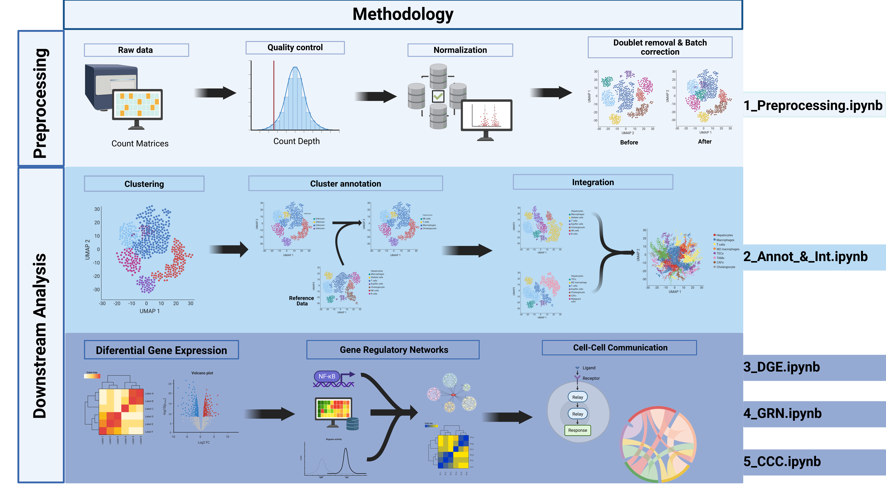

# Single Cell Analysis

This repository contains the code and resources associated with single cell analysis using Jupyter Notebook and the Scanpy library.


<h1 align="center">Abstract</h1>

<p align="center">
  
</p>

## References and Acknowledgments

This project is based on the best practices and tutorials from the scientific community. We especially thank the following works and publications for their contribution:

1. M.D. Luecken, F.J. Theis, "Current best practices in single-cell RNA-seq analysis: a tutorial", Molecular Systems Biology 15(6) (2019): e8746
2. Heumos, L., Schaar, A.C., Lance, C. et al. Best practices for single-cell analysis across modalities. Nat Rev Genet (2023). https://doi.org/10.1038/s41576-023-00586-w
3. Sanborn, Mark (2022). Sanbomics scripts. https://github.com/mousepixels/sanbomics_scripts

## Package Installation

To run the notebook of this project, the following libraries need to be installed (the version used for this analysis is also added):

### Python:

- gdown (v. 4.7.3)
- pandas (v. 2.2.0)
- numpy (v. 1.24.1)
- scipy (v. 1.13.0)
- matplotlib (v. 3.8.4)
- anndata (v. 0.10.5.post1)
- scanpy (v. 1.10.0)
- seaborn (v. 0.13.2)
- scvi (v. 1.0.4)

You can install these dependencies using pip:

```bash
pip install gdown pandas numpy scipy matplotlib anndata scanpy seaborn scvi
